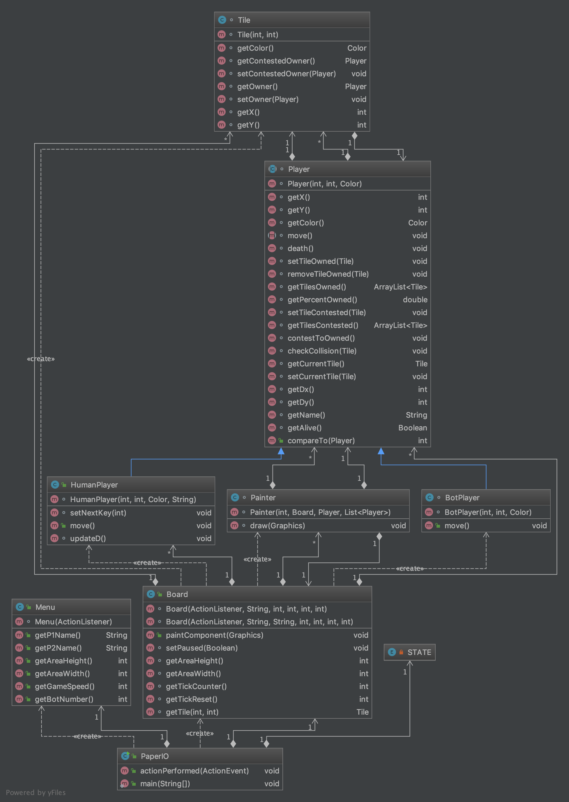

# paper.io
Java game based on [paper.io](http://paper-io.com). Made by [Vilhelm Melkstam](https://github.com/vilhelmmelkstam) and [Adam Halim](https://github.com/adamhalim).

Paper.io är ett relativt nytt spel online som kom i samma våg som många andra .io-spel så som agar.io och slither.io. Spelet finns under länken paper-io.com. Spelet är ett online multiplayer där man på en värld möter andra spelare.

När en spelare går med hamnar man på en slumpmässig server med andra spelare. Världen består av ett avgränsat kvadratiskt område där man först får ett litet område. Man kan sedan utöka sitt område genom att åka ut ur sitt område och rama in ett nytt område som sedan läggs till i ditt ursprungliga område när spelaren återvänder till området. Dock kan andra spelare köra över din svans medan du är på jakt efter nytt område för att förstöra dig. Spelet går då ut på att skaffa så stort område som möjligt.

### Funktionella krav
* Programmet ska kunna hantera minst en spelare och en datorspelare.
* Det ska finnas en live scoreboard medan man spelar.
* Programmet ska tillåta användare att välja namn.
* Spelet ska ha ett grafiskt gränssnitt.
* Spelet ska följa regler för Paper.io
	* När en spelare kör på en annan spelares svans utanför dess område ska den som blir överkörd förstöras.
	* Spelare genereras på slumpmässig, icke ockuperad, plats.
	* Varje spelare ska ha annorlunda färg
	* Om två spelare kolliderar rakt på ska den spelaren med minst andel av totalytan förstöras. 
	* Om en spelare kolliderar med väggen förstörs spelaren.

### Icke-funktionella krav
* Spelet ska vara skrivet i Java.
* Programmet ska ha en god objektorienterad design.
* Designen ska finnas dokumenterad, t.ex. i diagramform.
* Programmet ska vara så lätt att lära sig att en normalbegåvad labbassistent kan hantera det efter några minuters utbildning.

### Ideer till ytterligare funktionalitet
* Local multiplayer för fler spelare.
* Online multiplayer för fler spelare. (Väldigt extra funktionalitet)
* Smartare bots som analyserar närheten för att avgöra rörelser.
* Styra storlek på banan, antal datorspelare och hastighet själv.
* Möjlighet att spela med Power-Ups.
* Spara och visa highscores.

## Dokumentation
[Javadocs](https://vilhelmmelkstam.github.io/paper.io) finns tillgängligt.

### Övergripande kodstruktur
UML-diagrammet ser ut såhär:

Projektet består av åtta stycken klasser; `PaperIO`, `Menu`, `Board`, `Painter`, `Player`, `HumanPlayer`, `BotPlayer` och `Tile`. 

#### [PaperIO](https://vilhelmmelkstam.github.io/paper.io/se/liu/ida/paperio/PaperIO.html)
`PaperIO` är huvudklassen med `main`-metoden. Denna klass ansvarar för att skapa och styra över fönster samt hålla koll på nuvarande `STATE` samt att byta mellan olika `STATE`:s. 

#### [Menu](https://vilhelmmelkstam.github.io/paper.io/se/liu/ida/paperio/Menu.html)
`PaperIO` har en `Menu` som är huvudmenyn och ansvarar för att ta emot spelinställningar och starttryckning.

#### [Board](https://vilhelmmelkstam.github.io/paper.io/se/liu/ida/paperio/Board.html)
`Board` är logikklassen för spelet och ansvarar för spelets logik. `Board` skapar och administrerar spelplan, spelare och knappbindningar. Har även en timer för att uppdatera logiken i ticks. Klassen har en eller två `Painter`:s.

#### [Painter](https://vilhelmmelkstam.github.io/paper.io/se/liu/ida/paperio/Painter.html)
`Painter` används av `Board` för att rita spelplanen och spelare på den. En `Painter` ritar utifrån ens `Player`:s perspektiv och det den ser. Två `Painter`:s används för att visa splitscreen.

#### [Player](https://vilhelmmelkstam.github.io/paper.io/se/liu/ida/paperio/Player.html)
`Player` är en abstrakt klass som sköter all grundläggande logik för spelare. Det enda som skiljer sig åt mellan de klasser som ärver från `Player` är vad som får dem att röra på sig. Resten av logiken så som att hålla koll på namn, färg, ägda och omstridda `Tile`s, position och hastighetens riktning m.m.

#### [HumanPlayer](https://vilhelmmelkstam.github.io/paper.io/se/liu/ida/paperio/HumanPlayer.html)
`HumanPlayer` ärver från `Player` och är en spelare som kontrolleras av en männinska via tangentbordet. `HumanPlayer` ansvarar för att hålla koll på vilken riktning den ska röra sig i nästa tick samt att sedan röra sig enligt det.

#### [BotPlayer](https://vilhelmmelkstam.github.io/paper.io/se/liu/ida/paperio/BotPlayer.html)
`BotPlayer` ärver från `Player` och är en datorstyrd spelare. `BotPlayer` har logik för att bestämma riktning för att inte åka utanför banan men är annars slumpmässigt styrd.

#### [Tile](https://vilhelmmelkstam.github.io/paper.io/se/liu/ida/paperio/Tile.html)
`Tile` är en ruta i rutnätet. En `Tile` har en färg, en position och kan ha en ägare och en omstridd ägare. Dess färg beror på ägare och omstridd ägare.
